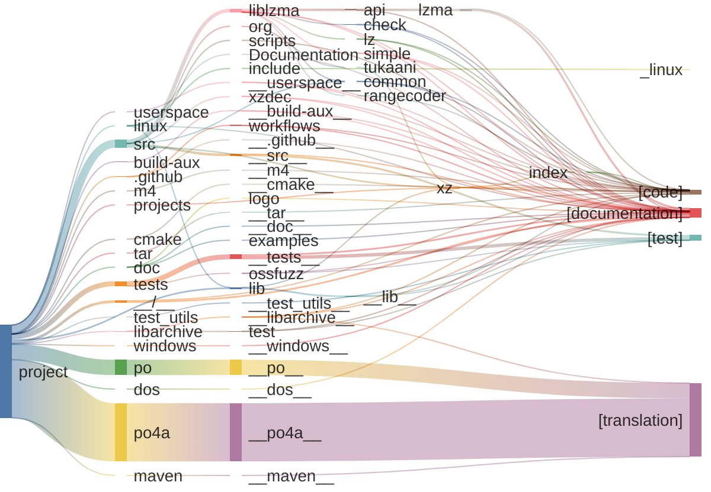

# Sankey files -> lines -> annotation

```mermaid
---
config:
  sankey:
    showValues: false
---

sankey-beta

project,__/__,2852
__/__,[documentation],1932
project,linux,20
linux,include,2
include,_linux,2
linux,[documentation],2
project,userspace,17
userspace,__userspace__,17
__userspace__,[documentation],15
__userspace__,[code],2
linux,Documentation,16
Documentation,[documentation],16
linux,lib,2
lib,xz,2
xz,[documentation],549
project,projects,7
projects,xz,7
xz,[code],1211
__/__,[code],920
project,src,8474
src,xz,1706
project,po,16413
po,__po__,16413
__po__,[translation],16413
src,liblzma,3909
liblzma,api,1713
api,lzma,1706
lzma,[documentation],2138
api,[documentation],7
liblzma,common,200
common,[documentation],150
common,[code],98
project,tests,5388
tests,__tests__,5337
__tests__,[test],3516
__tests__,[documentation],1821
project,doc,78
doc,logo,11
logo,[documentation],11
project,build-aux,491
build-aux,__build-aux__,491
__build-aux__,[code],421
project,m4,1
m4,__m4__,1
__m4__,[code],1
liblzma,check,779
check,[documentation],632
src,common,48
liblzma,lzma,842
lzma,[code],410
check,[code],147
project,.github,758
.github,workflows,721
workflows,[documentation],123
workflows,[code],598
project,lib,1716
lib,__lib__,1716
__lib__,[documentation],953
__lib__,[code],763
__build-aux__,[documentation],70
liblzma,lz,78
lz,[code],51
lz,[documentation],27
project,po4a,62136
po4a,__po4a__,62136
__po4a__,[translation],62136
liblzma,simple,206
simple,[documentation],71
simple,[code],135
src,scripts,2
scripts,[code],2
.github,__.github__,37
__.github__,[documentation],37
doc,__doc__,49
__doc__,[documentation],49
project,windows,3
windows,__windows__,3
__windows__,[documentation],3
liblzma,[documentation],4
liblzma,[code],4
liblzma,rangecoder,83
rangecoder,[documentation],83
project,dos,8
dos,__dos__,8
__dos__,[documentation],8
tests,ossfuzz,51
ossfuzz,[documentation],23
ossfuzz,[test],28
src,xzdec,146
xzdec,[documentation],80
xzdec,[code],66
project,cmake,5
cmake,__cmake__,5
__cmake__,[code],5
doc,examples,18
examples,[documentation],18
src,__src__,2615
__src__,[documentation],575
__src__,[test],2040
src,org,48
org,tukaani,48
tukaani,xz,48
xz,index,3
index,[code],2
index,[documentation],1
project,maven,4
maven,__maven__,4
__maven__,[translation],4
project,libarchive,799
libarchive,test,694
test,[test],366
project,test_utils,2
test_utils,__test_utils__,2
__test_utils__,[test],2
libarchive,__libarchive__,105
__libarchive__,[documentation],13
__libarchive__,[code],90
test,[documentation],328
__libarchive__,[translation],2
project,tar,7
tar,__tar__,7
__tar__,[code],7

```
