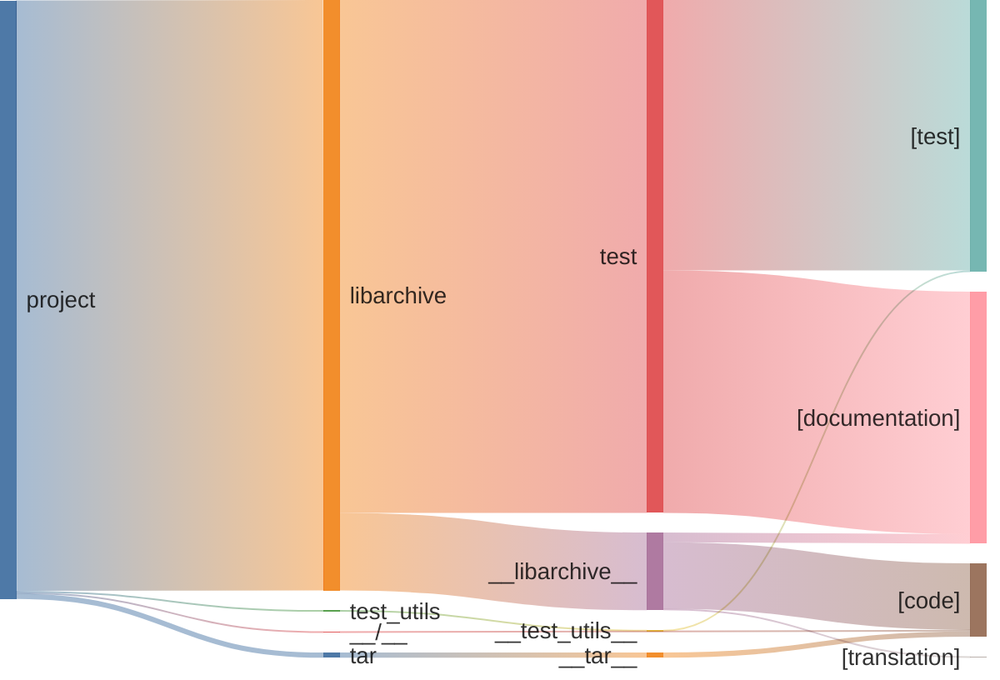

# Commits stats* All commits {len(all_commits)}
* Pure doc commits {len(all_commits) - len(non_doc_commits)}
# Lines stats
* code 40.25 %
* documentation 42.10 %
* test 17.65 %

# Sankey files -> lines -> annotation

