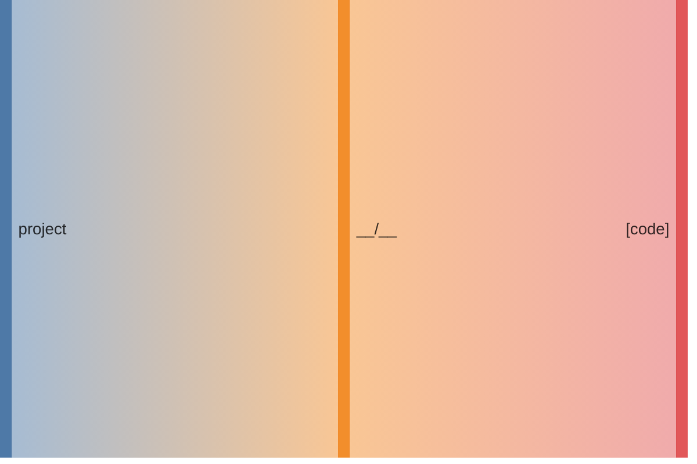

# Commits stats* All commits {len(all_commits)}
* Pure doc commits {len(all_commits) - len(non_doc_commits)}
# Lines stats
* code 100.00 %

# Sankey files -> lines -> annotation

```mermaid
---
config:
  sankey:
    showValues: false
---

sankey-beta

project,__/__,4
__/__,[code],4

```
