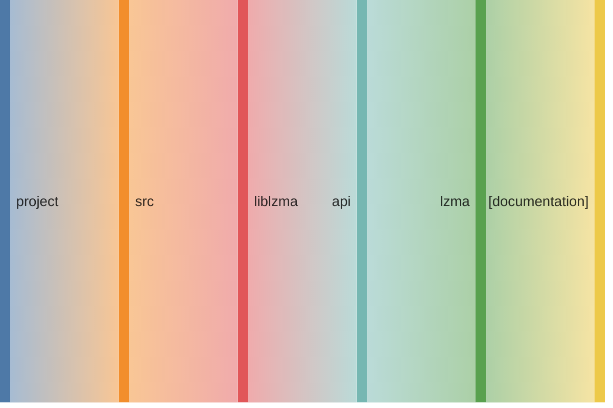

# Commits stats* All commits {len(all_commits)}
* Pure doc commits {len(all_commits) - len(non_doc_commits)}
# Lines stats
* documentation 100.00 %

# Sankey files -> lines -> annotation

```mermaid
---
config:
  sankey:
    showValues: false
---

sankey-beta

project,src,16
src,liblzma,16
liblzma,api,16
api,lzma,16
lzma,[documentation],16

```
