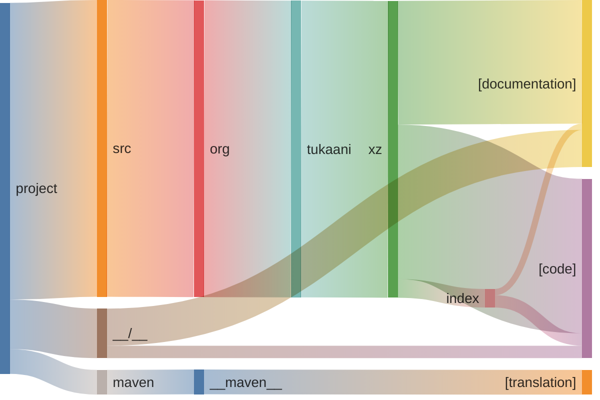

# Commits stats* All commits {len(all_commits)}
* Pure doc commits {len(all_commits) - len(non_doc_commits)}
# Lines stats
* documentation 45.00 %
* code 55.00 %

# Sankey files -> lines -> annotation

