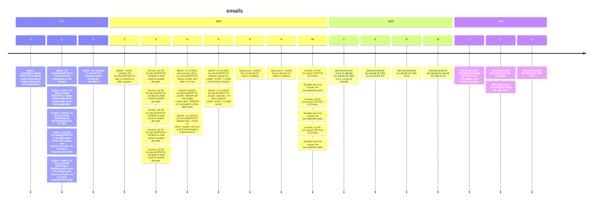

```mermaid
timeline
    title emails
    section 2021
        10: {patch, contact}[xz-devel] [PATCH] xz Added .editorconfig file for simple style guide encouragement
        11: {patch, no contact}[PATCH] xz Converted test framework to use Seatest
          : {patch, contact, re} Re [xz-devel] [PATCH] xz Added .editorconfig file for simple style guide encouragement
          : {review, contact, re} Re [xz-devel] Multithreaded decompression for XZ Utils.
          : {patch, contact} [xz-devel] [PATCH] xz Multithreaded mode now always uses stream_encoder_mt to ensure reproducible builds
          : {patch, contact, re} Re [xz-devel] [PATCH] xz Multithreaded mode now always uses stream_encoder_mt to ensure reproducible builds
        12: {patch, no contact} [xz-devel] XZ memory usage limiting for --threads=0
    section 2022
        2: {patch, review, contact} Re [xz-devel] [PATCH] add xz arm64 bcj filter support
        3: {review, re} Re [xz-devel] [PATCH v3] liblzma Add multi-threaded decoder
         : {review, re} Re [xz-devel] [PATCH v3] liblzma Add multi-threaded decoder
         : {review, re} Re [xz-devel] [PATCH v3] liblzma Add multi-threaded decoder
         : {review, re} Re [xz-devel] [PATCH v3] liblzma Add multi-threaded decoder
         : {review, re} Re [xz-devel] [PATCH v3] liblzma Add multi-threaded decoder
        4: {patch, no contact, pressuring, other} [xz-devel] [PATCH] String to filter and filter to string
         : {patch, contact} [xz-devel] [PATCH] LZMA_FINISH will now trigger LZMA_BUF_ERROR on truncated xz files right away
         : {patch, no contact} [xz-devel] [PATCH] Added NULL check to block_header_decode and documentation improvements
        5: {patch, no contact} [xz-devel] [PATCH] Added support for LZMA_SYNC_FLUSH in the block encoder
         : {patch, no contact} [xz-devel] [PATCH] stream_encoder_mt now supports LZMA_SYNC_FLUSH action
        9: {discussion, contct} Re [xz-devel] XZ Utils 5.3.3alpha
        9: {discussion, contct} Re [xz-devel] XZ Utils 5.3.3alpha
       10: {review, re} Re [xz-devel] [PATCH 0/2] tests: Disable bits that require the [encoder|threads]
         : {review, re} Re [xz-devel] [PATCH 0/2] tests: Disable bits that require the [encoder|threads]
         : {review, re} Re [xz-devel] [PATCH 0/2] tests: Disable bits that require the [encoder|threads]
    section 2023
        1: {announcement, move to github} [xz-devel] XZ Utils 5.4.1, xz.git on GitHub
        5: {announcement} [xz-devel] XZ Utils 5.2.12 and 5.4.3
        8: {announcement} [xz-devel] XZ Utils 5.4.4
       11: {announcement} [xz-devel] [xz-devel] XZ Utils 5.4.5
    section 2024
        1: {announcement, website} [xz-devel] XZ Utils 5.4.6, 5.5.1alpha, and website changes
        2: {announcement} [xz-devel] XZ Utils 5.5.2beta
         : {announcement} [xz-devel] [xz-devel] XZ Utils 5.6.0
        3: {announcement} [xz-devel] XZ Utils 5.6.1

```
