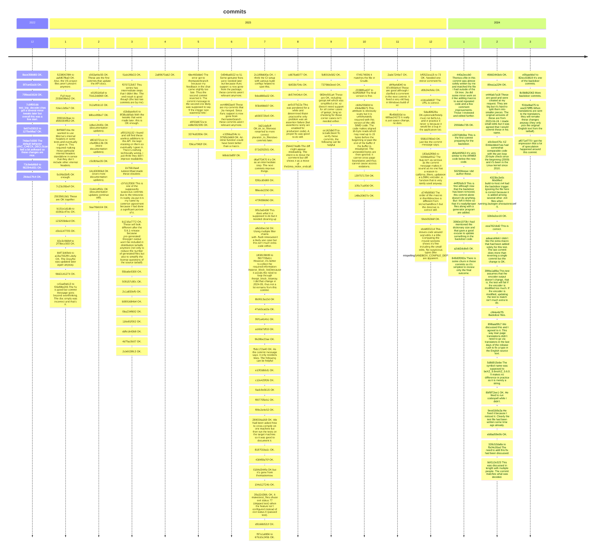

```mermaid
timeline
    title commits
    
    section 2022
      12 : 8ace358d65 OK.
         : 5f7ce42a16 OK.
         : 799ead162d OK.
         : 7c9ff5f166 test_lzip_decoder.chas got a several minor tweaks later but overall this was a fine start.
         : 5e57e33013 to 1275ebfba7 OK.
         : 74dae7d300 The default behavior ofAC_CHECK_DECLScan feel a bit awkward so these changes are nice.
         : 73c9e6d6b9 to f82294c831 OK.
         : 2fcba17fc4 OK.
    section 2023
       1 : 52380678f4 to aafd67fba0 OK. Also, the VS project files aren’t present anymore.
         : Full trust 203b008eb2 OK.
         : f16e12d5e7 OK.
         : 3959162bae to d550304f53 OK.
         : 84f9687cba He wanted to use liblzma’s internal headers in some tests and eventually I gave in. This required making those particular internal headers standalone in sense that they don’t include other internal headers.
         : 5c9fdd3bf5 OK enough.
         : 7c23c05bef OK.
         : 25035813d1 These are OK together.
         : b101e1d1db to d1561c47ec OK.
         : 123255b6ed OK.
         : d3e1147705 OK.
         : 82e3c968bf to 2f78ecc593 OK.
         : bbf71b69eb to a15a7552f9 Likely OK. The Doxyfile was updated later again anyway.
         : 9663141274 OK.
         : cc5aa9ab13 to f35d98e206 The fix is good but commit message goes beyond overthinking. The doc simply was incorrect and that’s it.
       2 : c563a4bc55 OK. These are the first commits that update the API docs.
         : e01f01b9af to 70d12dd069 OK.
         : 912af91b10 OK.
         : b8bce89be7 OK.
         : 1dbe12b90c OK (documentation updates).
         : d831072cce to efa498c13b OK (more documentation updates).
         : c9c8bfae35 OK.
         : 14cd30806d OK (even more documentation updates).
         : 01441df92c OK (documentation updates continue still).
         : 9aa7fdeb04 OK.
       3 : f1ab1f6b33 OK.
         : f070722b57 This series has intermediate steps that I didn’t like. The end result is good though (the last two commits are by me).
         : d1bdaaebc6 to 8f38cdd9ab With the tweaks that were made later, this is OK enough.
         : af55191102 I found and still find these useless additions to the API. He kept insisting on them so eventually I gave in. There’s nothing technically wrong, I just think they don’t improve readability.
         : 1b7661faa4 tuktest.hhad made these obsolete.
         : c97d12f300 This is one of the supposedly suspicous commits due to the timezone. In reality Jia put it in my name by common agreement because I had done a significant portion of it.
         : b1216a7772 OK. These will look different after the 5.6.1 release because pre-generated Doxygen output won’t be included in distribution tarballs anymore (not only to reduce the number of generated files but also to simplify the license questions of the source tarball).
         : 55ba6e9300 OK.
         : 509157c80c OK.
         : 2c1a830efb OK.
         : b0891684b4 OK.
         : 0ba234f692 OK.
         : 116e81f002 OK.
         : ddfe164368 OK.
         : 4d7fac0b07 OK.
         : 2cb6028fc3 OK.
       4 : 2a89670ab2 OK.
       5 : 6be460dde0 The error got to themasterbranch because my feedback in the chat came slightly too late. Thus the second commit reverted it. The commit message in the second one likely was supposed to say “if the integer size wasnot32 bits”.
         : d0f33d672a to ed8e552395 OK.
         : 3374a5359e OK.
         : f36ca7982f OK.
       6 : 0d94ba6922 to 51 Some genuine fixes were needed later but because ifunc support is now gone from the package, these commits aren’t relevant anymore.
         : ee44863ae8 These are my commits that Jia merged. Since ifunc support is now gone from themasterbranch, these commits aren’t relevant anymore.
         : e3356a204c to 97fd5cb669 OK. An inline function could have been better than a macro.
         : 66bdcfa85f OK.
       7 : 2c189bb00a OK. I think the CI setup with various build configs helped to spot this.
         : 9ded880a02 OK.
         : 5f3b898d07 OK.
         : a6583726e5 OK.
         : 3d21da5cff OK.str_to_filterwas renamed to more correct pluralstr_to_filterstwo commits later.
         : 072d292501 OK.
         : d6af7f3470 It’s OK as an intermediate step. The next commits improve things.
         : f281cd0d69 OK.
         : f86ede2250 OK.
         : 479fd58d60 OK.
         : 5f0c5a0438 This does what it is supposed to do but it needed cleaning up 
         : afb2dbec3d OK. Using multiple filter chains with--flush-timeoutisn’t a likely use case but this isn’t much extra code either.
         : 183819bfd9 to f907705eb1 However, it’s better to collect the required information inparse_block_list()because it avoids the need to loop through theopt_block_listarray. I did that change in 2024-05, thus not a lot remains from this commit.
         : 8b9913a13d OK
         : 47a63cad2a OK.
         : 95f1a414b1 OK.
         : a165d7df19 OK.
         : 9628be23ae OK.
         : f5dc172a40 OK. As the commit message says, it only reorders lines. The following can be helpful 
         : e10f2db5d1 OK.
         : c12e429f26 OK.
         : 9adc9e5615 OK
         : f907705eb1 OK.
         : f99e2e4e53 OK.
         : 289034a168 OK. We had been asked how to cross-compile on one machine but then run the tests on the target machine, so it was good to document it.
         : 818701ba1c OK.
         : 43845fa70f OK.
         : 0184d344fa OK but it’s gone from themasternow.
         : 194d12724b OK.
         : 39a32d36fc OK. It makestest_files.shuse exit status 77 (skipped test) when the feature isn’t configured instead of exit status 0 (passed test).
         : d9166b52cf OK.
         : f97a1afd56 to 67610c245b OK.
       8 : cd678a6077 OK.
         : 6bf33b704c OK.
         : de574404c4 OK.
         : ae5c07b22a This was pondered for a while and determined thatin practicethe only problem was an assertion failure (but assertions rarely are enabled for production code). A proper fix was good to do still.
         : 2544274a8b The diff might appear misleading. The intent is to move the comment but diff shows it as a move of thelzma_index_endcall.
       9 : 5d691fe582 OK.
         : 7379bb3eed OK.
         : 9834e591a4 These are OK, including getopt.m4 which was simplified a lot. xz doesn’t need support for all corner cases of getopt_long so checking for those corner cases isn’t needed either.
         : ce162db07f to 1c1a8c3ee4 To verify these commits, the following can be helpful 
      10 : f74f174006 It matches the file in Gnulib.
         : 233885a437 to 419f55f9df The final version is fine.
         : c60b25569d to 4f44ef8675 This attribute is obviously scary but it is unfortunately required with this version of the x86 SIMD code. The code makes aligned 16-byte reads which may read up to 15 bytes before the beginning or past the end of the buffer if the buffer is misaligned. The unneeded bytes are then ignored. It cannot cross page boundaries and thus cannot cause access violations.
         : 1397571704 OK.
         : 105c7ca90d OK.
         : 148e20607e OK.
      11 : 2ade7246e7 OK.
         : d4f4a4d040 to 87c956d4c4 These are good although I clarified a comment in the next commit. It fixed a very old bug in Windows build of xz.
         : ffb456593d to 689ae24273 It really is just space change, no dots.
      12 : bf0521ea15 to 73 OK. Needed one minor comment fix.
         : d0b24efe6c OK.
         : e1b1a9d637 The URL is correct.
         : 5dad6f628a OK.optionsdefinitely must not beNULL, and in practice it never is because it would be a bug in the application too.
         : 55810780e0 OK, just like the commit message says.
         : 183a62f0b5 to b34b6a9912 The bug isn’t as serious as the commit message makes it sound as no one has a reason to calllzma_filters_updateon a LZMA1 encoder, a function that is very rarely used anyway.
         : d74fb5f060 The order of the macros in the#ifdirective is different from src/xz/sandbox.h but the directive is correct still.
         : 5feb09266f OK.
         : ebddf20214 This moves code around and edits it a little. Comparing the moved sections shows it’s fine including the small edits. No suspicious typos (like mispellingSANDBOX_COMPILE_DEFINITION) are apparent.
    section 2024
       1 : 440a2eccb0 Theriscv.cfile in this commit was almost solely written by me and matched the file I had outside of the Git tree. Jia did some minor work on it like adding macros to avoid repeated code and a few comment improvements. Those I reviewed and edited further.
         : 2959dbc735 OK.
         : e2870db5be This is the first commit preparing for the backdoor.
         : db5eb5f563 It’s very similar to the ARM64 code below the new code.
         : 50255feeaa I did author these.
         : 44ff2fa5c9 This is fine although now that the backdoor has been removed, this commit alone doesn’t do anything. But I left it there so that it’s readyifproper files along with a generator program are added.
         : 3060e1070b I had mentioned the dictionary size and that gave a good excuse to update something in the backdoor code.
         : a2dd2dc8e5 OK.
         : 849d0f282a There is some churn in these commits so it’s simplest to review only the final outcome.
       2 : 45663443eb OK.
         : 89ea1a22f4 OK.
         : e446ab7a18 These are good and were created at my request. They are big but it’s hard to split them into smaller pieces. The original versions of these are from 2023-04-24. I made small edits but it was agreed that I would commit these in his name.
         : e0c0ee475c XZ Embedded has had somewhat comparable code with the per-loop 20-byte check since the beginning (2009) and it’s been in the Linux kernel since 2010.
         : 4323bc3e0c Modified build-to-host.m4 had the backdoor trigger. Ignoring the file here is correct because it is added among several other .m4 files when running./autogen.shorautoreconf -fi.
         : 32b0a3ce19 OK.
         : eea78216d2 This is correct.
         : adaacafde6 I didn’t like the extra macro that had been added solely for this test. The last commit does more than reverting a single commit but the change is OK.
         : 39f4a1a86a This test assumes that the encoder output doesn’t change, that is, the test will fail if the encoder is modified too much. If the encoder is modified, updating the test to match isn’t much extra to do.
         : cf44e4b7f5 Backdoor files.
         : 898aad9fc7 We discussed this and I agreed to it. This way man page translations didn’t need to go via translators in the last days of the release rush to fix a typo in the English source text.
         : 5d8d915ebe The symbol name was supposed to beXZ_5.6notXZ_5.6.0. It makes no difference in practice as it is merely a string.
         : 8bf9f72ee1 OK. He liked to run codespell while I didn’t.
         : 9eed1b9a3a He fixed it because I noticed it. Clearly the test file had been written some time ago already.
         : eb8ad59e9b OK.
         : 328c52da8a to f9cf4c05ed The need to add this fix had been discussed.
         : bbf112e323 This was discussed in length with multiple people. The commit matches what was decided.
       3 : e5faaebbcf to 82ecc53819 It’s one of the backdoor commits.
         : 8c9b8b2063 More backdoor commits.
         : f01be8ad75 to eee579fff5 When translations are sent to the translators, they will remake these changes anyway (they only pick the original English text from the tarball).
         : af071ef770 I got the impression that a lot of speculation happened around this commit.

```
